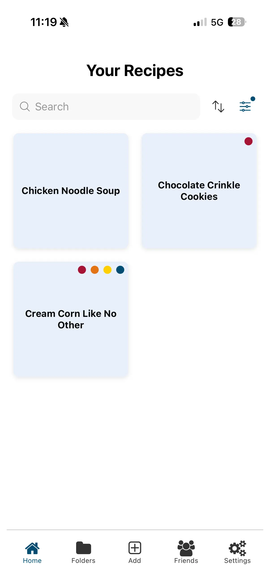
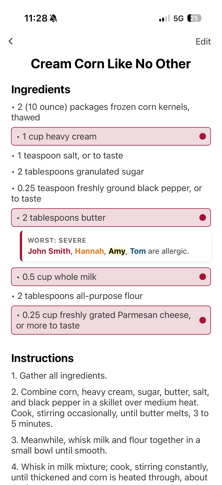
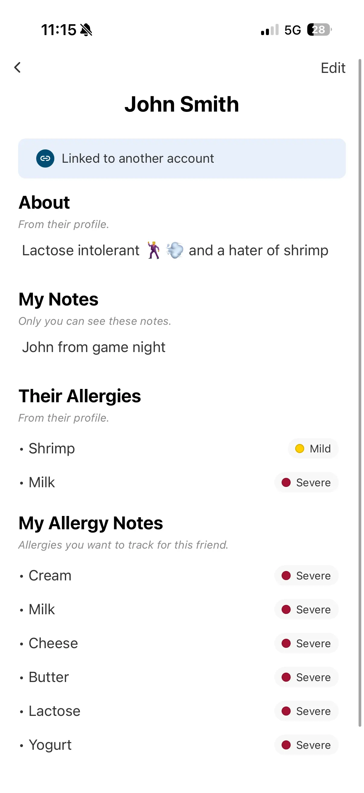
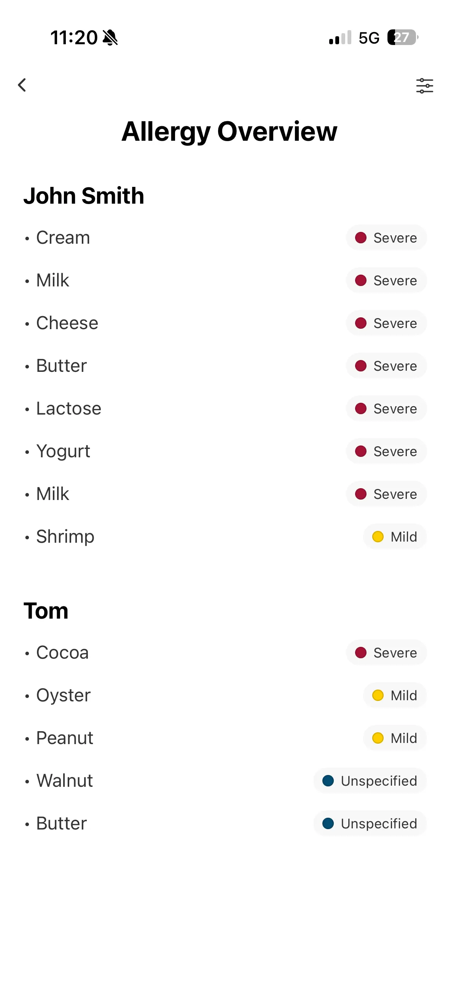
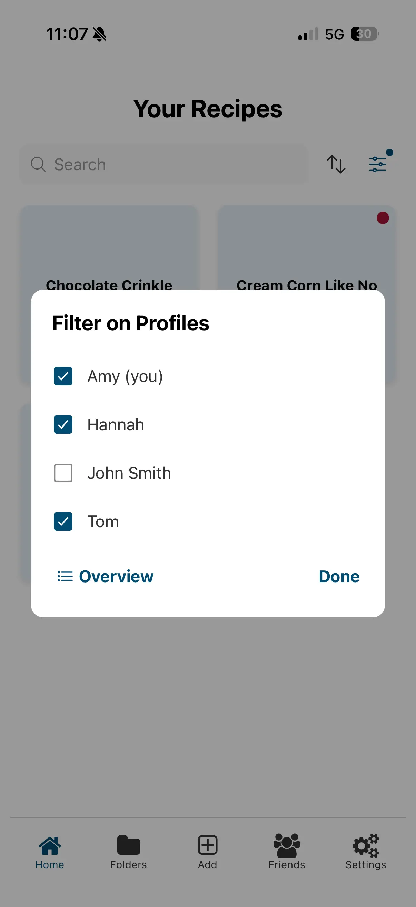

<p align="center">
  
</p>

# RecipeGuard

RecipeGuard is a React Native + Expo app with a Supabase backend for storing recipes, organizing them into folders, and tracking food allergies for yourself and friends. The app allows you to filter your recipes based on different profiles and more easily see when a recipe contains someone's allergen (or dietary preference). Friend profiles can be made either by the user or by linking to a friend's existing profile.


<p align="center">
  
  
  
  
  
</p>


## Features

- Create, edit, and delete recipes
- Add recipes by pasting a link (auto-parsed) or entering them manually
- Organize recipes into folders, with multi-select bulk delete
- Search recipes and friends by name
- Sort recipes and folders by date added, last edited, recently opened, or alphabetical — ascending or descending, persisted per-user per-screen
- Track allergies for yourself and friends, each with its own severity level
- Filter by allergies for different people and groups, plus a standalone allergy overview summary
- Severity-aware allergy warnings inside recipes and in list
- Friend profile linking via unique friend codes
- High-contrast accessibility mode
- Persistent per-user filters and preferences
- Instant list loads with a stale-while-revalidate cache
- Authentication with Supabase Auth


## Allergy System

This app includes an allergy-aware filtering system.

### Features

- Personal allergies
- Friend allergies
- Severity levels
    - Unknown 
    - Mild
    - Moderate
    - Severe
- Dedicated allergy editor (per-allergy severity, add/remove) shared by your own profile and friend profiles
- Standalone Allergy Overview screen — a read-only summary across any set of people
- Ingredient-level warnings
- Recipe-level warning dots
- Persistent allergy filters

### Severity Colors

- Severe → Red
- Moderate → Orange
- Mild → Yellow
- Unknown → Gray


## Friend System

Users can:

- Add manual friends
- Link friends to real accounts using friend codes
- Search their friends list by name
- Track friend allergies
- Store private notes per friendship

Linked friendships automatically include the friend's public allergies in allergy filtering.


## Accessibility

A per-user high-contrast mode, toggled from the Accessibility screen and stored on the profile. The preference updates instantly (optimistic cache update) and adjusts text-oriented affordances — allergy severity text, search bar icons/placeholders — across the app.


## Tech Stack

### Frontend

- React Native
- Expo SDK 54
- React Navigation
- react-native-svg
- react-native-vector-icons

### Backend

- Supabase
    - Postgres
    - Auth
    - Row Level Security (RLS)
- AsyncStorage
    - Session persistence
    - Local recipe-open timestamps
    - Per-user filter persistence
    - Sort preferences
    - Cached list snapshots (recipes, folders, friends)
    - Local storage keys are namespaced per-user.


## Project Structure

```txt
recipes/
├── App.js
├── lib/
│   ├── supabase.js
│   ├── auth-context.js
│   ├── storage.js
│   ├── cache.js
│   └── api/
├── screens/
├── components/
├── styles/
├── constants/
├── assets/
└── docs/
```


## Authentication Flow

The app conditionally renders navigators based on session state:

```txt
No session  -> AuthStack
Session     -> AppStack
```


### AuthStack
- Landing
- Login
- SignUp
- PrivacyPolicy
- ForgotPassword

### AppStack
- Home
- RecipeCard
- EditRecipe
- InputSelector
- Folders
- FolderDetail
- Friends
- FriendProfile
- Profile
- EditAllergies
- AllergyOverview
- Settings
- Accessibility
- PrivacyPolicy


## Setup

These environment variables are required to connect to the Supabase database. See .env.example for an example .env file.

```env
EXPO_PUBLIC_SUPABASE_URL
EXPO_PUBLIC_SUPABASE_PUBLISHABLE_KEY
SUPABASE_SECRET_KEY
```


## Running Locally

Install dependencies:

```bash
npx expo install
```

Run the app:

```bash
npx expo start --tunnel
```

Run on iOS using the Expo Go app.


## Future Plans
- [ ] Apple app store deployment
- [ ] Recipe sharing
- [ ] Collaborative folders
- [ ] Image-based recipe parsing
<!-- - [ ] Re-enable Supabase email authentication on sign up
- [ ] AI-assisted recipe import -->

## Development Notes

### Package Management

Always install Expo-compatible packages using:

```bash
npx expo install <package>
```

Do not use:

```bash
npm install <package>
```

for Expo-managed dependencies.


### Security

- Row Level Security (RLS) is enabled on all tables
- All rows are scoped to the authenticated user
- Friend-code lookup is handled through a restricted RPC
- Friend list reads go through a `get_my_friends` RPC that only returns a linked friend's public profile fields (name, about) — private fields like email are never exposed to other users


### Sorting

Three screens render sortable grids — Home (recipes), Folders (folders),
and FolderDetail (recipes inside a folder). They all share the same
architecture so the sort UI, persistence, and ordering behave
identically across the app:

- **[`lib/sort.js`](lib/sort.js)** owns the sort options
  (`RECIPE_SORT_OPTIONS`, `FOLDER_SORT_OPTIONS`), the defaults, a
  `normalizeSort()` back-compat shim, and the pure `sortRecipes` /
  `sortFolders` helpers. Sort math lives here; screens just call into it.
- **[`components/SortMenu.js`](components/SortMenu.js)** is a stateless
  pop-down: a radio list of options plus an asc/desc direction toggle.
  Used by all three screens with different `options` arrays.
- **AsyncStorage keys** persist each screen's selection per-user:
  - `KEYS.homeSort(userId)` — Home recipes
  - `KEYS.foldersSort(userId)` — Folders grid
  - `KEYS.folderRecipesSort(userId)` — recipes inside any folder

Each screen holds the `sort` state, hydrates it from AsyncStorage on
mount (via `normalizeSort()` so any legacy bare-string entries upgrade
cleanly to the `{ by, dir }` shape), saves on change, and feeds the
result through `sortRecipes` / `sortFolders` before rendering. A small
primary-colored dot on the sort icon signals a non-default selection.

To add a sort key, add an entry to the relevant options array in
`lib/sort.js` and a branch in `recipeKey()` / `folderKey()` — every
consumer screen picks it up automatically. See
[docs/ARCHITECTURE.md](docs/ARCHITECTURE.md#sorting-home-folders-folderdetail)
### Icons

Every icon used in the app is exported from a single registry at
[`components/icons/index.js`](components/icons/index.js). Screens import
semantic, named components (`<BackIcon>`, `<TrashIcon>`,
`<CheckboxIcon checked />`, etc.) from `'../components/icons'` — no
screen or shared component imports `react-native-vector-icons` directly.

The registry contains three flavors:

- **Custom SVG icons** — `PlusIcon`, `SearchIcon`, `SortIcon`,
  `FilterIcon`, `EditIcon`. One file each, rendered via `react-native-svg`.
- **Vector-icon wrappers** — `BackIcon`, `TrashIcon`, `EllipsisIcon`,
  `CheckIcon`, `RemoveCircleIcon`, `ShareIcon`, `LinkIcon`,
  `LinkOutlineIcon`, `ImageIcon`, `KeyIcon`, `PersonAddIcon`,
  `AllergyListIcon`, `ExternalLinkIcon`, `FolderIcon`. Each pins a
  semantic name to one Ionicons/FontAwesome glyph and exposes optional
  `size`, `color`, and `style` props.
- **Stateful wrappers** — `CheckboxIcon` (`checked` / `partial`),
  `SelectCircleIcon` (`selected`), `RadioIcon` (`selected`),
  `SortArrowIcon` (`direction: 'asc' | 'desc'`), and `TabIcon` (matches
  the bottom-tab route name). They pick the right glyph internally so
  the caller doesn't manage paired icon strings.

To swap a glyph across the app (change vendor, switch outline →
filled, replace with a custom SVG), edit the registry in one place and
every consumer picks it up. See
[docs/ARCHITECTURE.md](docs/ARCHITECTURE.md#componentsicons--central-icon-registry)
for the full pattern.
